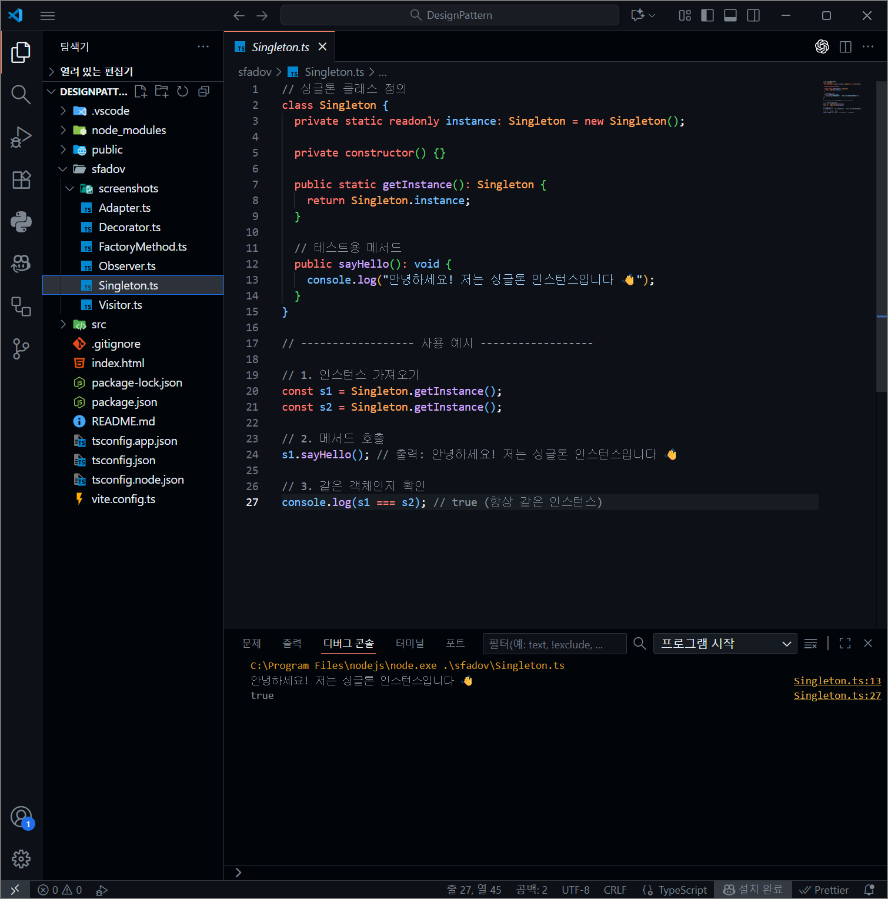
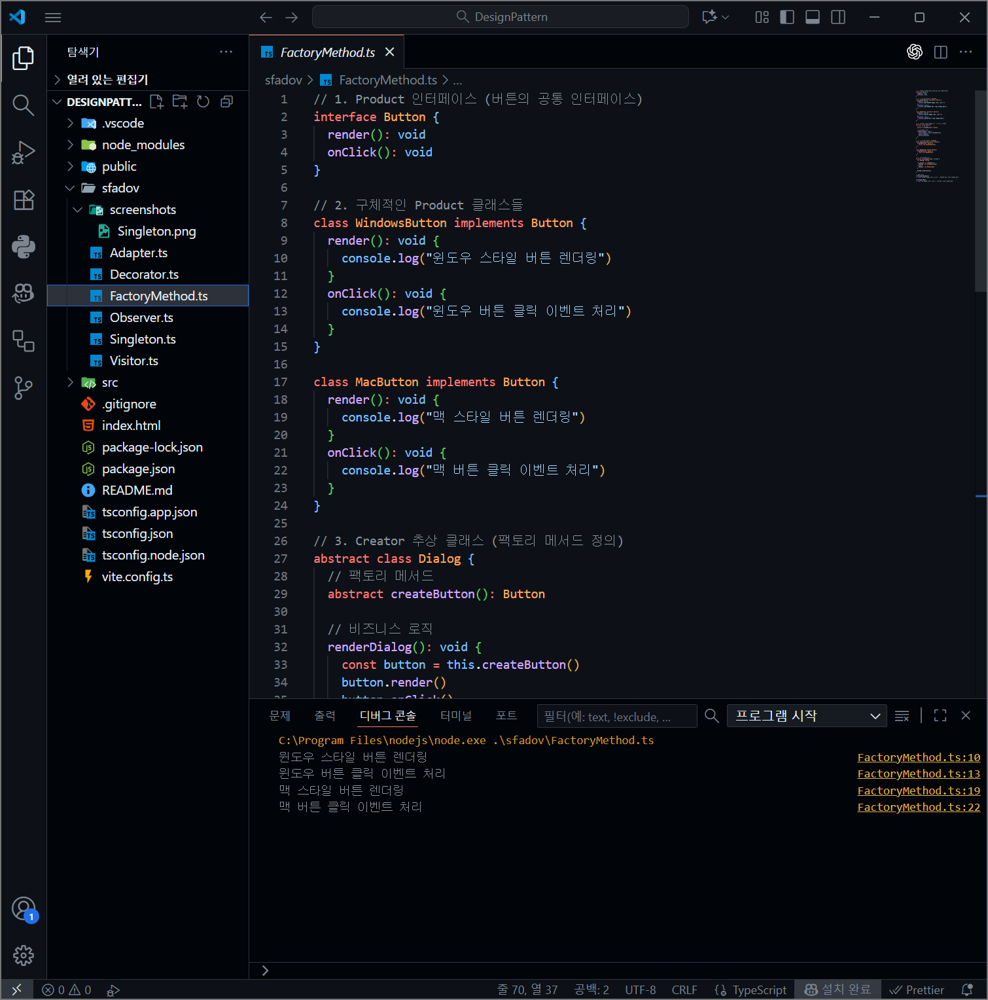
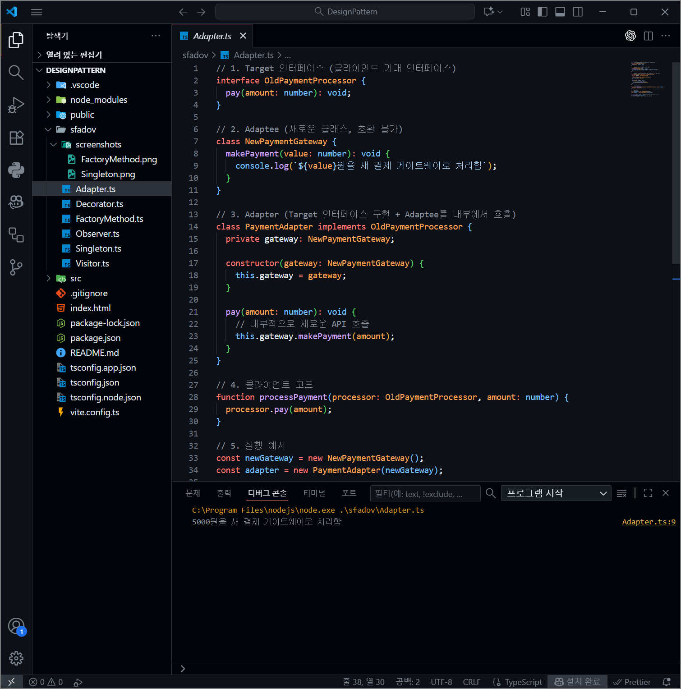
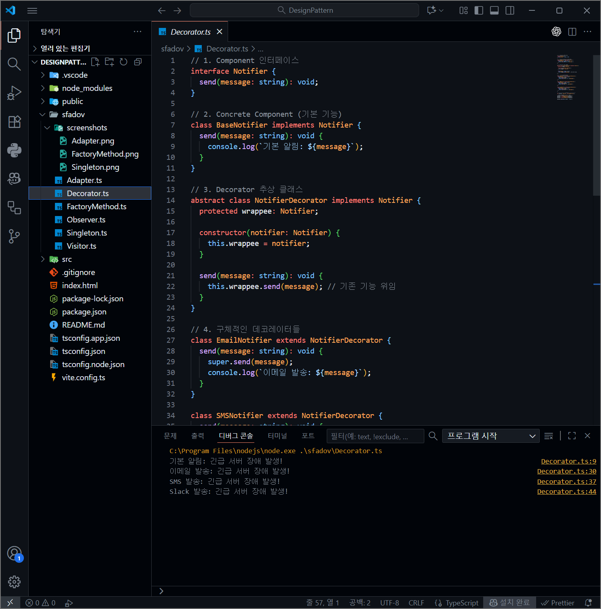
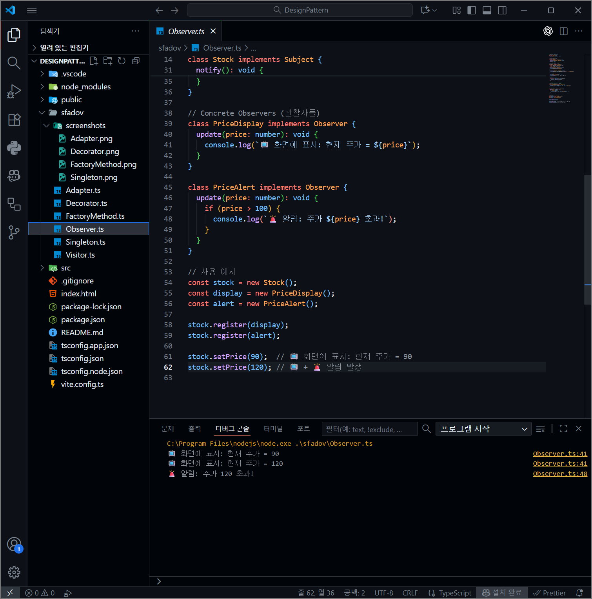
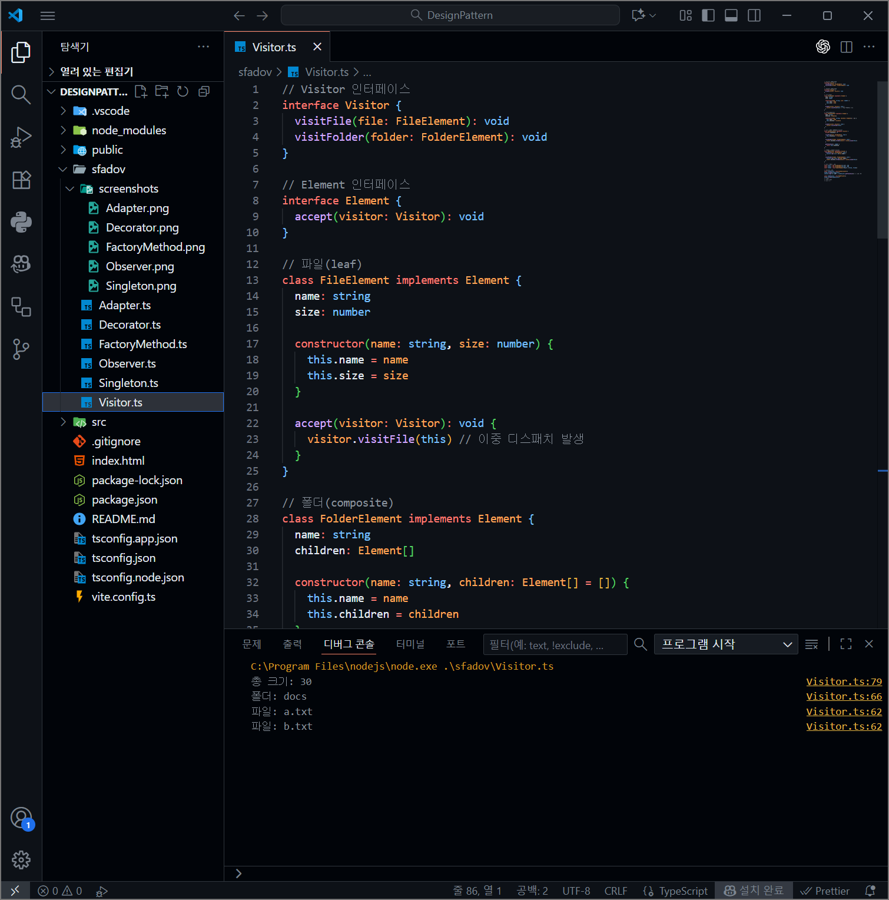
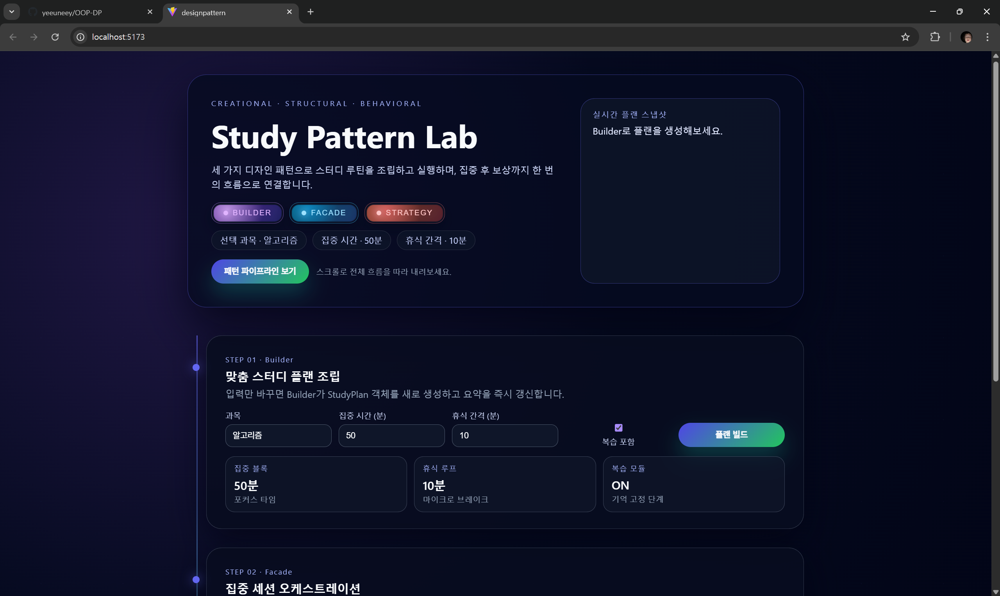
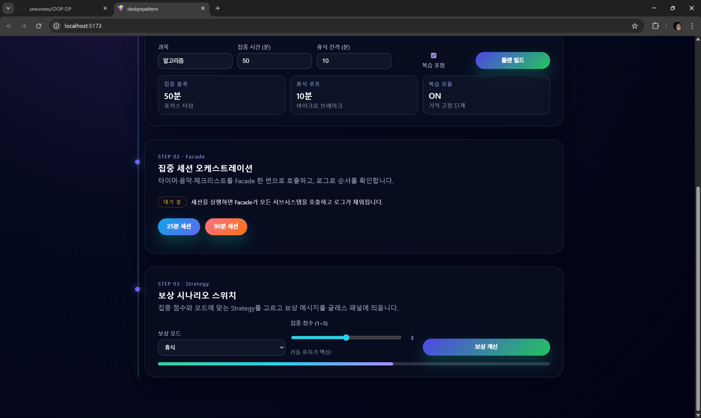

# 객체지향 디자인 패턴 실습

---

## 1. 기본 예제 실행 결과

> 스크린샷 파일은 `screenshots` 폴더에 위치합니다.

| 패턴 | 실행 화면 |
|:-----|:----------|
| **Singleton** |  |
| **Factory Method** |  |
| **Adapter** |  |
| **Decorator** |  |
| **Observer** |  |
| **Visitor** |  |

---

## 2. 실습 구현 과제
> 스크린샷 파일은 `screenshots` 폴더에 위치합니다.

### 2-1. 개요

Vue + TypeScript를 이용하여 **객체지향 디자인 패턴 3가지**를 직접 설계·구현한 실습입니다.  
“스터디 코치(Study Coach)” 웹앱 안에서 다음 패턴들을 적용했습니다.

- 생성(Creational) 패턴: **Builder 패턴**
- 구조(Structural) 패턴: **Facade 패턴**
- 행위(Behavioral) 패턴: **Strategy 패턴**

브라우저에서 한 페이지로 세 패턴의 동작을 직접 확인할 수 있도록 구성했습니다.

### 2-2. 구현한 디자인 패턴

#### 1. 생성 패턴 – Builder

사용자가 입력한 값(과목, 총 공부 시간, 쉬는 시간 간격, 복습 여부)을 바탕으로 하나의 스터디 플랜 객체(`StudyPlan`)을 **단계적으로 조립**하기 위해 Builder 패턴을 사용했습니다.

> **효과**  
> 생성자 인자가 복잡해지는 것을 피하고, “무엇을 설정하는지”가 눈에 잘 보이는 형태로 객체를 생성할 수 있습니다.

#### 2. 구조 패턴 – Facade

집중 세션을 시작할 때 실제로는 다음과 같은 여러 기능이 필요합니다.

- 집중 타이머 시작
- 공부용 Lo-Fi 음악 재생
- 오늘 할 문제 체크리스트 준비

이러한 **여러 서브시스템을 숨기고**, 클라이언트(`App.vue`)는 `facade.startShortSession(subject)` 같이 **단순한 메서드 한 번만 호출**하면 모든 동작이 이루어지도록 하기 위해 Facade 패턴을 적용했습니다.

> **효과**  
> 타이머, 음악, 체크리스트 구현이 어떻게 바뀌더라도 Facade의 인터페이스만 유지되면 클라이언트 코드는 수정 없이 재사용 가능합니다.

#### 3. 행위 패턴 – Strategy

사용자가 선택한 **보상 모드**(휴식 모드, 게임 모드, 성장 모드)와 오늘의 **집중 점수(1~5)**에 따라 서로 다른 보상 메시지를 보여주고자 했습니다.

보상 정책을 하나의 파일에 조건문으로만 몰아넣는 대신, 각 정책을 별도의 “전략” 클래스로 분리해 **유연하게 교체 가능**하게 만들기 위해 Strategy 패턴을 적용했습니다.

> **효과**  
> 새로운 보상 정책을 추가할 때 기존 코드를 거의 건드리지 않고, 새로운 전략 클래스를 추가하는 것만으로 쉽게 확장할 수 있습니다.

#### 4. App.vue – 세 가지 패턴 통합 화면

`App.vue`는 위 세 패턴을 **한 페이지에서 동시에 확인**할 수 있도록 다음과 같이 구성했습니다.

1) 생성 패턴 – 스터디 플랜 생성 영역
- **입력**
  - 과목, 총 공부 시간, 쉬는 시간 간격, 복습 여부
- **동작**
  - Builder 패턴으로 `StudyPlan`을 생성한 뒤, 결과를 요약 문장 형태로 화면에 출력

2) 구조 패턴 – 집중 세션 시작 영역
- **버튼**
  - “짧은 세션 시작 (25분)”
  - “딥워크 세션 시작 (90분)”
- **동작**
  - Facade 패턴으로 여러 서브시스템을 한 번에 호출하고, 실행 과정을 로그 리스트로 출력

3) 행위 패턴 – 보상 전략 영역
- **선택**
  - 보상 모드 (휴식 / 게임 / 성장)
  - 집중 점수 (1 ~ 5)
- **동작**
  - Strategy 패턴으로 모드별 보상 메시지를 계산하고, 결과를 화면에 표시